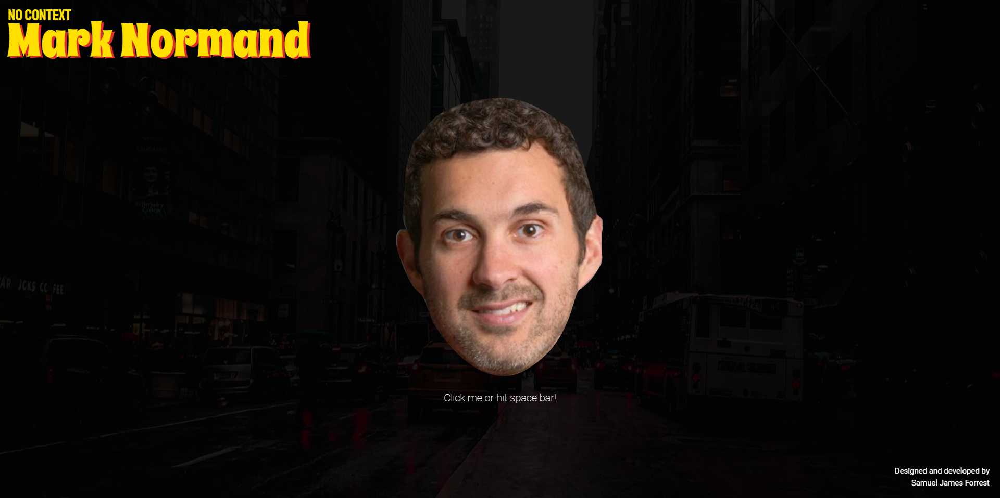

# No Context Mark Normand!

Since discovering him in 2018, [Mark Normand](https://twitter.com/marknorm?ref_src=twsrc%5Egoogle%7Ctwcamp%5Eserp%7Ctwgr%5Eauthor) has quickly become one of my favourite comics. Having watched his special - [Out to Lunch](https://www.youtube.com/watch?v=tDolNU89SXI&ab_channel=marknormand) - and many of his podcast appearances, it still surprises me that Mark doesn't enjoy more acclaim. After all, how many comedians have been praised by George Carlin for having 'a real talent for jackin' around'?

I wanted to create a project that would help spread the Normand love - but what could I do that would be original and interesting? That is when it hit me.

I could take a comedian's words out of context.

This give birth to 'No Context Mark Normand' - a place to hear those quick zingers at the touch of a button.

Most of the soundbites used in this project are taken from Mark's special _Out to Lunch_, with the exception of two being taken from Mark's appearance on episode #1420 of _The Joe Rogan Experience_.

With the introductions done, all that's left to say is:

**COMEDY!**

## Features

### Existing features

#### Head wobble animation

- When an audio clip is played, a "head wobble" animation activates for the duration of the sound bite. Retrieving the audio clips' durations was initially quite difficult - see _"Bugs"_ below.

### Features to be implemented

#### Other comedians

- To use this project as a template to create a "No Context" soundboard for other comedians - some potential candidates being:
  - James Acaster
  - Theo Von
  - Dave Chappelle
  - Ricky Gervais
  - Bo Burnham

#### Secret Kevin Hart transition

- To add in a sound bite of Mark Normand's "I'm Kevin Hart" sign off - and implemenet logic to change the head image to Kevin Hart while that particular soundbite plays.

#### Safe for work version

- To add a button/toggle to the page that, when activated, stops any potentially offensive sound bites from playing. Although, I am afraid that if it is ever switched on, there will only be one sound bite left.

#### Sound bite selection

- To add a menu, either on screen or as one that enters the screen when toggled, that has a button for each sound bite - allowing the user to listen to all the sound bites.

## Technologies used

### Languages

- [HTML](https://developer.mozilla.org/en-US/docs/Learn/Getting_started_with_the_web/HTML_basics)
- [SCSS](https://sass-lang.com/)
- [JavaScript](https://developer.mozilla.org/en-US/docs/Web/JavaScript)

### Libraries

- [Bootstrap 5](https://getbootstrap.com/docs/5.0/getting-started/introduction/)

### Design

- [Figma](https://www.figma.com/)

## Bugs

### #1: More than one audio file playing at a time

**Bug**

- If a user clicks the Mark button - or hits the space bar - repeatedly, multiple audio clips play at the same time.

**Fix**

- Within the 'speak' function, that plays the audio clip, I added logic that [removes the event listener](https://developer.mozilla.org/en-US/docs/Web/API/EventTarget/removeEventListener) from both the Mark button and space bar before the audio clip plays. This removes the user's ability to activate the 'speak' function while an audio clip is playing. Then, I used the ['ended' event listener](https://developer.mozilla.org/en-US/docs/Web/API/HTMLMediaElement/ended_event) to add the event listeners back to the Mark button and space bar, only once the audio clip had ended.

### #2: Syncing up audio and animations

**Bug**

- When trying to set the duration of the 'head wobble' animation, the current audio's duration kept returning as NaN.

**Fix**

- I discovered that the duration kept returning as NaN because the audio's source was not preloaded. I tried to output the duration as a number using the [onloadedmetadata event](https://www.w3schools.com/jsref/event_onloadedmetadata.asp), but to no avail. Eventually, I decided that I would have to add an `<audio>` tag in for each audio clip (despite oringally not wanting to do this, to save cluttering my HTML file). This allowed me to set the duration of the animation to the same duration as the audio.
- **Note:** After getting the audio's duration to output as a number, the animation was still not moving. This is because I had not added an 's' to the end of the value to define its value in second. I did this using the following template string: `` button.style.animationDuration = `${audioClip.duration}s`; ``

## Credits

- I would like to thank [W3 Schools](https://www.w3schools.com/jsref/prop_audio_duration.asp), and the ["Web Dev"](https://www.youtube.com/watch?v=E-v4SSCG6i4&ab_channel=WebDev) for providing the solution to retrieving the audio clips' durations.
- I would like to thank Mark Normand for the inspiration for this project.
